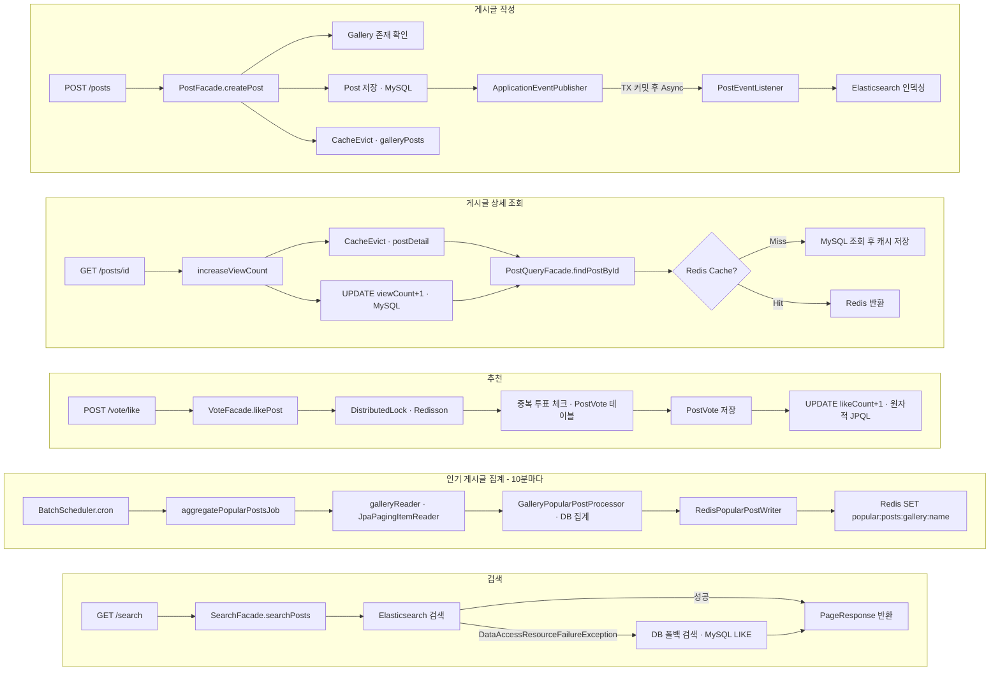
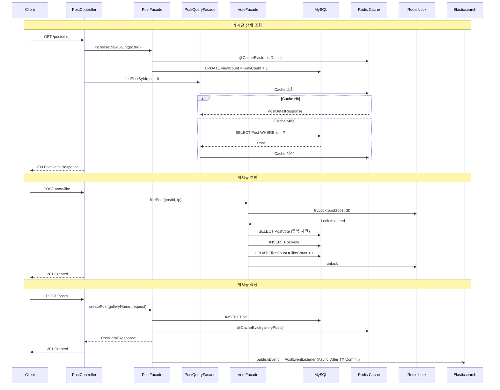
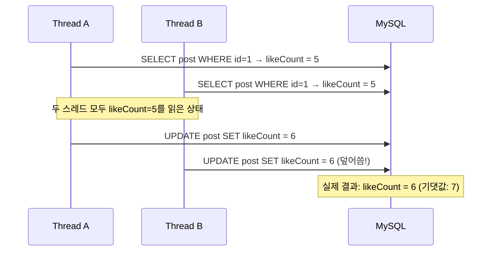
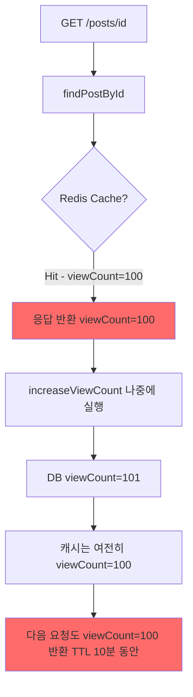
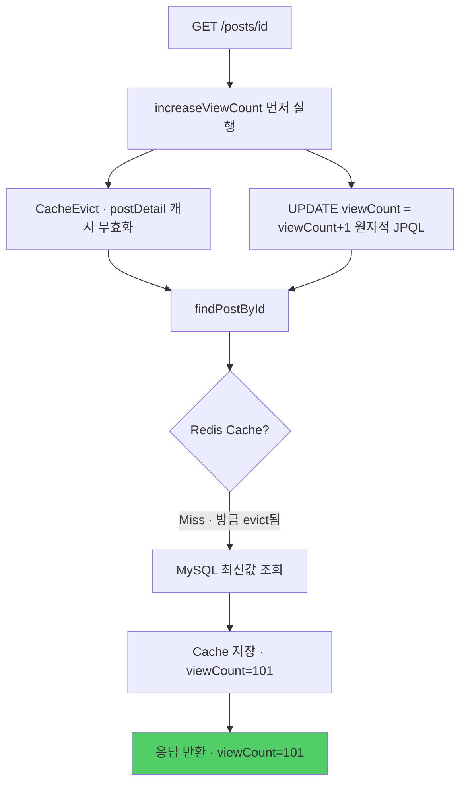
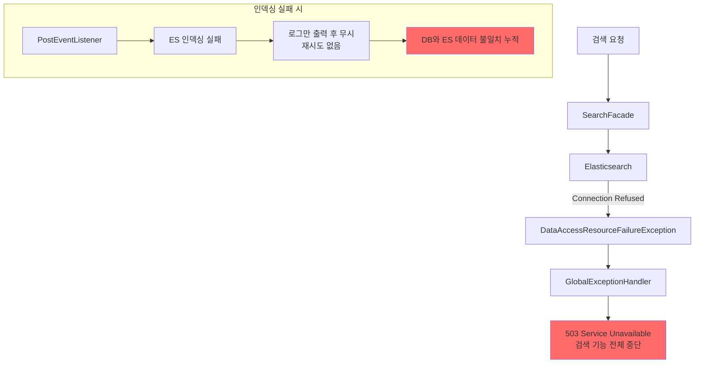
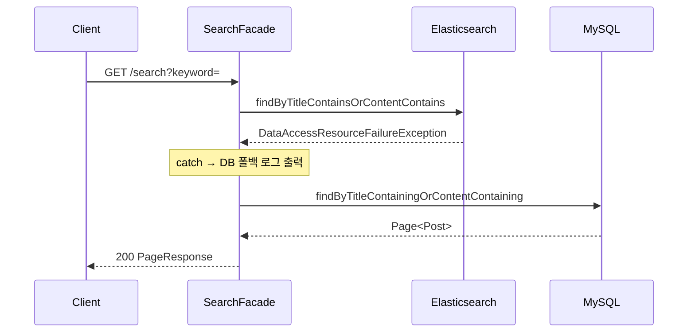
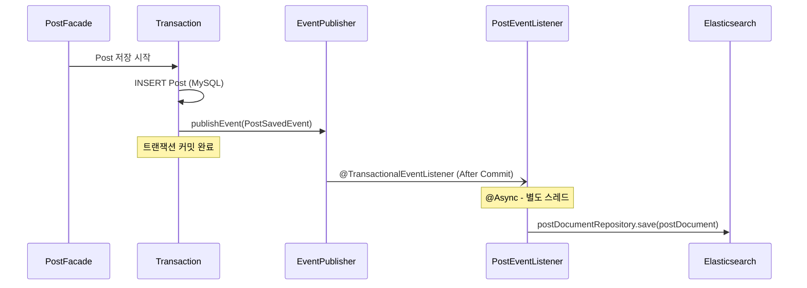

# 익명 게시판 프로젝트 — 포트폴리오 문제 해결 보고서

> **프로젝트**: Spring Boot 기반 DCInside 스타일 익명 게시판

| 분류 | 기술 | 버전 |
|------|------|------|
| Language | Java | 17 |
| Framework | Spring Boot | 3.5.4 |
| Framework | Spring Security | 6.5.x (Boot managed) |
| ORM | Spring Data JPA / Hibernate | 6.6.x (Boot managed) |
| DB | MySQL Connector/J | 8.x (Boot managed) |
| Cache | Spring Cache + Redis (Lettuce) | Boot managed |
| Distributed Lock | Redisson | 3.27.2 |
| Search | Spring Data Elasticsearch | 5.x (Boot managed) |
| Batch | Spring Batch | 5.x (Boot managed) |
| Mapping | MapStruct | 1.5.5.Final |
| Util | Lombok | Boot managed |
| Test Data | DataFaker | 2.1.0 |

---

## 전체 아키텍처

```
┌─────────────────────────────────────────────────────────────────┐
│                        Client (HTTP)                            │
└─────────────────────────┬───────────────────────────────────────┘
                          │ REST API
┌─────────────────────────▼───────────────────────────────────────┐
│                   Presentation Layer                            │
│  PostController · CommentController · VoteController           │
│  ReportController · SearchController · ImageController         │
└──────────────┬──────────────────────────────┬───────────────────┘
               │ Command                      │ Query
┌──────────────▼───────────┐   ┌──────────────▼────────────────┐
│     Command Facade        │   │        Query Facade           │
│  PostFacade               │   │  PostQueryFacade              │
│  CommentFacade            │   │  SearchFacade                 │
│  VoteFacade               │   │                               │
│  ReportFacade             │   │  @Cacheable (Redis)           │
│  ImageFacade              │   │                               │
│  GalleryFacade            │   │                               │
└──────┬──────────┬─────────┘   └───────┬───────────────────────┘
       │          │                     │
       │    ┌─────▼──────┐        ┌─────▼──────┐
       │    │   Redisson  │        │   Redis    │
       │    │ Distributed │        │   Cache    │
       │    │    Lock     │        │(galleryPosts│
       │    └─────────────┘        │ postDetail)│
       │                          └─────────────┘
┌──────▼──────────────────────────────────────────────────────────┐
│                      Domain Layer                               │
│  Post · Comment · Vote · Report · Gallery · PostImage          │
│  JPA Repository (원자적 JPQL @Modifying 쿼리)                   │
└──────────────────────────┬──────────────────────────────────────┘
                           │
              ┌────────────▼───────────────┐
              │         MySQL              │
              │  (ddl-auto: create)        │
              └────────────────────────────┘

┌─────────────────────────────────────────────────────────────────┐
│                   비동기 / 배치 레이어                           │
│                                                                 │
│  ApplicationEventPublisher ──► PostEventListener (Async)       │
│                                      │                         │
│                                      ▼                         │
│                               Elasticsearch                    │
│                               (posts 인덱스)                   │
│                                                                 │
│  BatchScheduler (Cron: 10분) ──► Spring Batch Job              │
│                                      │                         │
│                          JpaPagingItemReader (Gallery)         │
│                          GalleryPopularPostProcessor (DB 집계)  │
│                          RedisPopularPostWriter (Redis 저장)    │
└─────────────────────────────────────────────────────────────────┘
```

---

## 전체 데이터 플로우


---

## 전체 시퀀스 다이어그램



---

## 문제 해결 사례

---

## 사례 1. 추천/신고 카운트의 Lost Update — 원자적 쿼리와 분산 락의 결합

### 문제



- `VoteFacade.likePost()`는 Redisson `@DistributedLock`으로 중복 투표를 방지했지만, 카운트 증가는 JPA 엔티티를 메모리에 로드한 뒤 `post.increaseLikeCount()`를 호출하는 방식이었다.
- 락이 해제된 직후 다른 스레드가 이미 이전 값을 읽어 둔 엔티티로 UPDATE를 수행하면 한 번의 추천이 소실(Lost Update)되는 경쟁 조건이 발생한다.
- 게시글 추천·비추천·신고·댓글 수 총 7개 카운트 필드가 모두 동일한 패턴으로 구현되어, 트래픽이 몰릴수록 카운트 오차가 누적되는 구조적 문제가 있었다.

### 해결

- `PostRepository`와 `CommentRepository`에 `@Modifying(clearAutomatically = true) @Query("UPDATE ... SET likeCount = likeCount + 1 ...")` 형태의 원자적 JPQL 쿼리를 추가하고, 모든 카운트 증가 호출을 교체했다.
- DB가 현재 값을 직접 읽어 +1하는 방식이므로 트랜잭션 격리 수준과 무관하게 동시 실행해도 카운트 오차가 발생하지 않으며, `clearAutomatically = true`로 1차 캐시도 자동 무효화된다.
- 분산 락은 중복 추천 방지만 담당하고, 카운트 정확성은 DB 원자적 연산이 보장하도록 책임을 분리해 두 메커니즘이 서로 다른 역할을 명확히 수행한다.

### 결과

- 동시 추천 요청이 몇 건이 들어오든 DB의 `SET likeCount = likeCount + 1`이 직렬화되어 처리되므로 카운트 손실이 발생하지 않는다.
- 분산 락 + 원자적 쿼리의 이중 보호 구조로 중복 투표와 카운트 부정확 문제를 동시에 해결했으며, 7개 카운트 필드 전체에 동일한 패턴이 일관되게 적용되었다.
- 인메모리 엔티티 수정 방식에서 DB 직접 연산 방식으로 전환해 JPA Dirty Checking 의존성을 제거하고 코드 의도가 명확해졌다.

---

## 사례 2. 조회수와 캐시 정합성 — @CacheEvict 순서와 원자적 증가의 조합

### 문제



- 상세 조회 API는 `findPostById()`(@Cacheable)로 캐시를 먼저 조회한 뒤, `increaseViewCount()`로 DB를 증가시키는 순서였다.
- 반환된 응답에는 방금 증가하기 전의 viewCount가 담기고, 캐시 TTL(10분) 동안 모든 사용자에게 이전 조회수가 계속 표시되는 정합성 문제가 발생했다.
- viewCount 증가 또한 JPA 엔티티 메모리 수정 방식이었으므로, 동시 조회 요청 시 Lost Update 위험도 함께 존재했다.

### 해결



- `increaseViewCount()`에 `@CacheEvict(value = "postDetail", key = "#postId")`를 추가해 DB 증가와 동시에 해당 게시글의 캐시를 무효화한다.
- 컨트롤러에서 호출 순서를 증가 먼저, 조회 나중으로 바꿔 `findPostById()`가 항상 캐시 미스 상태에서 최신 DB 값을 읽도록 한다.
- viewCount 증가도 `UPDATE viewCount = viewCount + 1` 원자적 쿼리로 전환해 동시 조회 요청에서도 카운트가 정확하게 반영된다.

### 결과

- 사용자가 게시글을 열면 항상 방금 증가된 최신 viewCount를 받으며, 캐시 조회 직후 다시 채워지므로 이후 트래픽은 Redis에서 처리되어 DB 부하가 낮게 유지된다.
- 게시글 수정/삭제 시 `@Caching(evict = {postDetail, galleryPosts})` 패턴도 동일하게 적용되어, 캐시-DB 정합성이 모든 쓰기 작업에서 일관되게 보장된다.
- 단순한 호출 순서 변경과 애노테이션 추가만으로 캐시 정합성 문제를 해결해, 별도의 캐시 동기화 인프라 없이 Spring Cache 기능만으로 일관성을 확보했다.

---

## 사례 3. Elasticsearch 장애 시 전체 검색 불능 — DB 폴백과 이벤트 기반 인덱싱 분리

### 문제



- 검색은 Elasticsearch에만 의존했고 폴백이 없어, ES가 내려가면 `DataAccessResourceFailureException`이 전파되어 사용자에게 503이 반환됐다.
- 게시글 작성/수정 시 ES 인덱싱은 `@TransactionalEventListener + @Async` 조합으로 수행됐는데, 인덱싱 실패 시 로그만 남기고 재시도 없이 무시되어 ES와 DB 간 데이터 불일치가 쌓일 수 있었다.
- ES 장애가 발생하면 검색 서비스 전체가 중단되고, 그 사이 작성된 게시글은 ES에 인덱싱되지 않아 장애 복구 후에도 검색 결과에 누락되는 문제가 있었다.

### 해결

**① 검색 폴백 — ES 장애 시 DB 자동 전환**



**② 이벤트 기반 인덱싱 — 트랜잭션 안전성 보장**



- `SearchFacade`에서 `DataAccessResourceFailureException`을 catch하여 이미 `PostRepository`에 정의된 DB 검색 쿼리로 자동 폴백해, ES 장애 중에도 검색 기능이 중단되지 않는다.
- `@TransactionalEventListener`로 트랜잭션 커밋 이후에만 이벤트를 수신하므로 DB 저장이 확정된 데이터만 ES에 인덱싱되어 롤백 시 ES 오염을 방지한다.
- `@Async`로 별도 스레드에서 인덱싱을 처리하므로 ES 응답 지연이 HTTP 응답 시간에 영향을 주지 않는다.

### 결과

- Elasticsearch가 정상일 때는 전문 검색(Full-text)의 이점을 누리고, 장애 상황에서는 MySQL LIKE 검색으로 자동 전환되어 서비스 연속성을 보장한다.
- 트랜잭션 커밋 후 비동기 인덱싱 구조 덕분에 ES 인덱싱 지연이 HTTP 응답 시간에 영향을 주지 않으며, DB 커밋이 확정된 데이터만 인덱싱되어 데이터 정합성이 유지된다.
- 단일 catch 블록과 기존 DB 쿼리 재사용만으로 폴백을 구현해 추가 인프라 없이 가용성을 높였으며, ES 복구 후에는 자동으로 ES 검색이 재개된다.

---

## 부록 — 핵심 기술 선택 근거

| 기술 | 채택 이유 |
|------|-----------|
| **Redisson 분산 락** | Lettuce pub/sub 방식 대비 tryLock 타임아웃 제어 용이, SpEL로 동적 락 키 생성 가능 |
| **Spring Cache + Redis** | 갤러리 목록/게시글 상세의 반복 조회 비용 감소, TTL 10분으로 DB 부하 분산 |
| **Spring Batch** | 10분 주기 인기 게시글 집계를 청크 단위(chunk=100)로 처리, 실패 재시작 포인트 관리 |
| **@TransactionalEventListener** | DB 커밋 확정 전 ES 인덱싱 방지, 트랜잭션 롤백 시 ES 오염 예방 |
| **원자적 JPQL @Modifying** | 동시성 높은 카운트 필드를 애플리케이션 레벨 락 없이 DB 레벨에서 안전하게 처리 |
